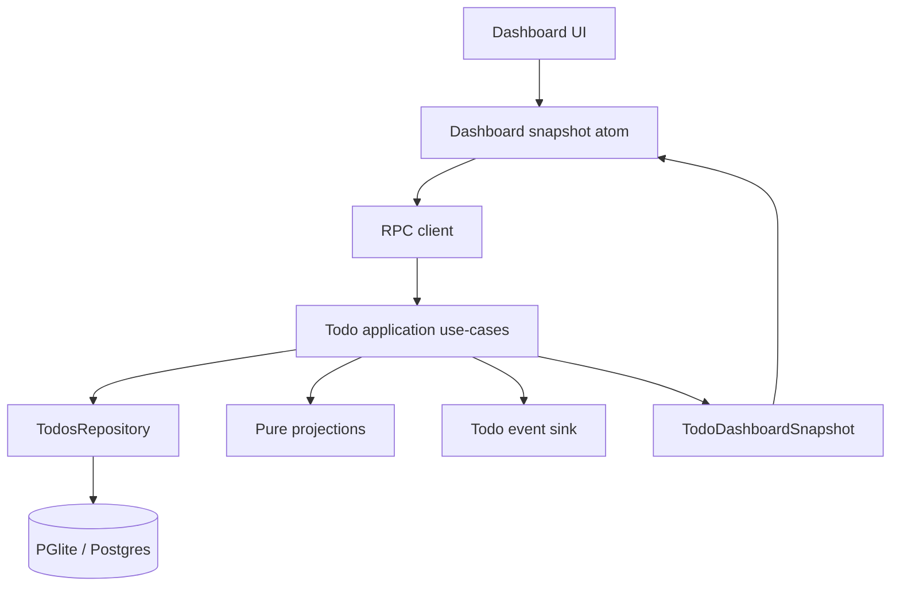
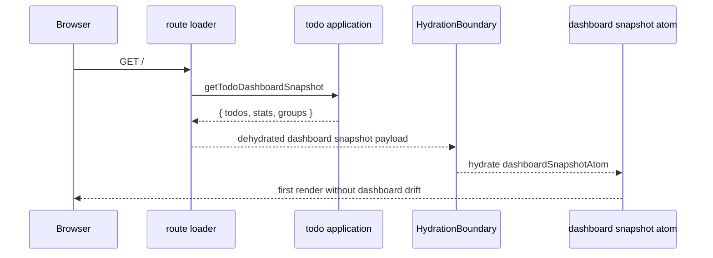
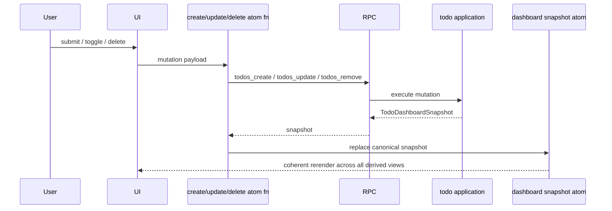

# Todo Dashboard

## Overview

The home route restores the richer todo sample instead of a flat CRUD list.
It exists to demonstrate three things at once:

1. **server-derived dashboard read models**
2. **SSR hydration from one canonical dashboard snapshot atom**
3. **single-flight mutation coherence across list, stats, and grouped views**

The dashboard now supports:

- due dates
- overdue, today, upcoming, unscheduled, and completed classification
- summary cards
- grouped board filters
- recent activity
- snapshot-returning mutations

## Why this sample is intentionally richer

A plain todo list is too small to show how the stack behaves once multiple read
models depend on the same mutation.

This dashboard is the smallest sample in the repository that still proves:

- repository persistence and migration behavior
- domain classification rules
- RPC and HTTP parity
- hydration from one canonical dashboard snapshot on first render
- client-side synchronization without duplicating server derivation logic

## Core design decisions

### Snapshot mutations instead of local client recomputation

`create`, `update`, and `remove` return a `TodoDashboardSnapshot`.
The client writes that snapshot into one canonical dashboard snapshot atom, and
all dashboard views derive from that shared source.

Why:

- stats and grouping must stay coherent
- classification logic lives on the server once
- the UI does not risk drifting from the service rules

### UTC date strings for due dates

Due dates use `YYYY-MM-DD` strings and are interpreted as UTC calendar days.
This avoids local timezone drift when comparing or formatting due dates.

### Unscheduled is explicit

The previous dashboard implementation treated null due dates ambiguously.
The restored version makes them first-class:

- they count toward `active`
- they count toward `unscheduled`
- they render in an `Unscheduled` group
- they are not mixed into `upcoming`

This keeps stats and grouping logically aligned.

## Data flow

## Initial page load

## Mutation flow

## Key files

- `src/api/todo-schema.ts`
  - dashboard-capable todo domain types
- `src/db/schema.ts`
  - `due_date` and `updated_at` persistence columns
- `src/db/todos-repository.ts`
  - CRUD persistence and compatibility migrations
- `src/features/todos/application.ts`
  - canonical use-cases, event publication, and snapshot orchestration
- `src/features/todos/projections.ts`
  - pure ordering, classification, stats, groups, and snapshot derivation
- `src/features/todos/events.ts`
  - replication boundary for future outbox / queue growth
- `docs/reference/todo/atoms.tsx` (symlinked to `src/routes/-index/`)
  - **canonical dashboard snapshot atom plus derived view atoms**
  - **Reference implementation for the Effect-native Atoms pattern**
  - See: `docs/architecture/effect-native-atoms.md`
- `src/routes/index.tsx`
  - SSR hydration of the dashboard snapshot source of truth
- `docs/reference/todo/*.tsx` (symlinked to `src/routes/-index/`)
  - dashboard surfaces composed from the current design system
  - **Study these for architectural patterns, not visual design**

## Reference Implementation

The todo dashboard serves as the **canonical reference implementation** for the Effect-native Atoms pattern.

### Location

- Real files: `docs/reference/todo/`
- Runnable via: `src/routes/-index/` (symlink)

### Purpose

This is a **reference for architectural patterns**, not a template to copy visually.

**✅ Copy these patterns:**

- Atom wiring with `runtime.atom()` and `runtime.fn()`
- SSR hydration with `serializable()`
- Derived view atoms with `mapSnapshotAtom()`
- Hook patterns with `useAtomValue` and `useAtomSet`
- Component structure and composition

**❌ Don't copy these:**

- Visual styling, colors, spacing
- Specific UI layouts
- "Prussian" branding elements
- Card designs and visual treatments

Build YOUR visual design using `src/design-system/` primitives.

See: `docs/guides/adding-new-features.md` for the copy-paste pattern guide.

## Classification invariants

For every snapshot:

- `stats.total === todos.length`
- `stats.completed === completed group count`
- `stats.overdue === overdue group count`
- `stats.dueToday === today group count`
- `stats.upcoming === upcoming group count`
- `stats.unscheduled === unscheduled group count`
- every todo appears in exactly one group

Those invariants are verified in `src/features/todos/application.test.ts`,
`src/features/todos/projections.test.ts`, and the transport parity tests under
`src/routes/api/-lib/`.
