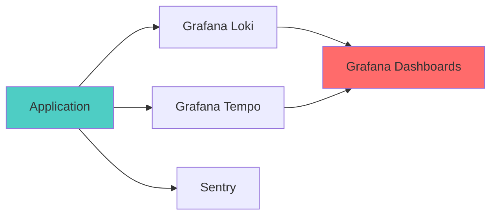

# Telemetry Guide

Complete guide to observability with OpenTelemetry, Sentry, and Grafana Loki.

## Overview



## Integration Options

### Option A: @sentry/effect (Recommended for Effect v4)

Effect-native Sentry integration using `@sentry/effect`. Errors, traces, logs, and metrics flow to Sentry through Effect's Layer system.

**File:** [`src/lib/sentry-effect.ts`](../../src/lib/sentry-effect.ts)\
**Guide:** [Sentry Effect Integration](./sentry-effect-integration.md)

```typescript
import { SentryLive } from "@/lib/sentry-effect"

export const ServerRuntimeLive = TodosApplicationLive.pipe(
  Layer.provideMerge(ObservabilityRuntimeLive), // OTEL → Tempo/Loki
  Layer.provideMerge(SentryLive), // Sentry → Sentry backend
)
```

### Option B: @sentry/node (Imperative)

Traditional Sentry SDK for non-Effect code paths or migration scenarios.

**File:** [`src/lib/server-init.ts`](../../src/lib/server-init.ts)

See [TESTING_AND_TELEMETRY.md](../../TESTING_AND_TELEMETRY.md) for complete documentation.

## Quick Start

### Server-Side Tracing

**Profiling note:** Continuous profiling (Pyroscope) is **Node-only**. Bun runs without profiling.

```typescript
import { Effect } from "effect"
import { createSentryTelemetryLayer } from "./lib/telemetry-server"

const TelemetryLive = createSentryTelemetryLayer({
  serviceName: "my-service",
  environment: "production",
})

const program = Effect
  .gen(function*() {
    yield* Effect.log("Processing request")
    // Your code here
  })
  .pipe(Effect.withSpan("myOperation"))

Effect.runPromise(program.pipe(Effect.provide(TelemetryLive)))
```

#### Effect.fn Spans (Automatic)

Use `Effect.fn` for named, traced functions. This creates spans automatically at call sites when OpenTelemetry is enabled.

```typescript
import { Effect } from "effect"

const fetchUser = Effect.fn("fetchUser")(function*(userId: string) {
  // business logic
  return { id: userId }
})
```

Minimal rule: use `Effect.fn` for important service functions, and `Effect.withSpan` for ad-hoc blocks or extra attributes.

### Client-Side Error Tracking

```typescript
import { initClientSentry } from "./lib/telemetry-client"

initClientSentry({
  sentryDsn: import.meta.env.VITE_SENTRY_DSN,
  environment: import.meta.env.MODE,
})
```

### Logging to Loki

```typescript
import { createLokiLoggerLayer } from "./lib/logger-loki"

const LoggerLive = createLokiLoggerLayer({
  endpoint: "http://localhost:3100/loki/api/v1/push",
  labels: { job: "my-app" },
})
```

## Viewing Data

- **Grafana**: http://localhost:3001
- **Sentry**: http://localhost:9000

See [Telemetry Example](../../src/telemetry-example.ts) for complete examples.

> **Metrics Cardinality Warning**: This app uses traces and logs, which are safe from cardinality limits. If you add **OTel metrics** (Counters, Histograms) in the future, never use high-cardinality attributes like `userId`, `requestId`, or `todoId`—these cause "cardinality explosion" and trigger `otel.overflow`, making your metrics lie.
